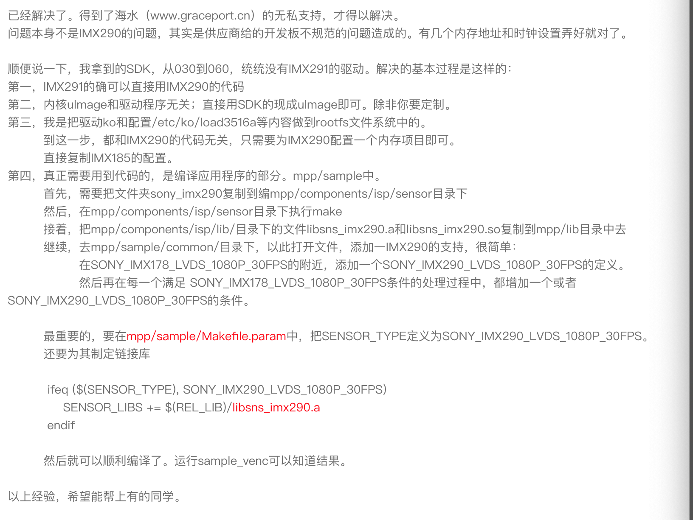
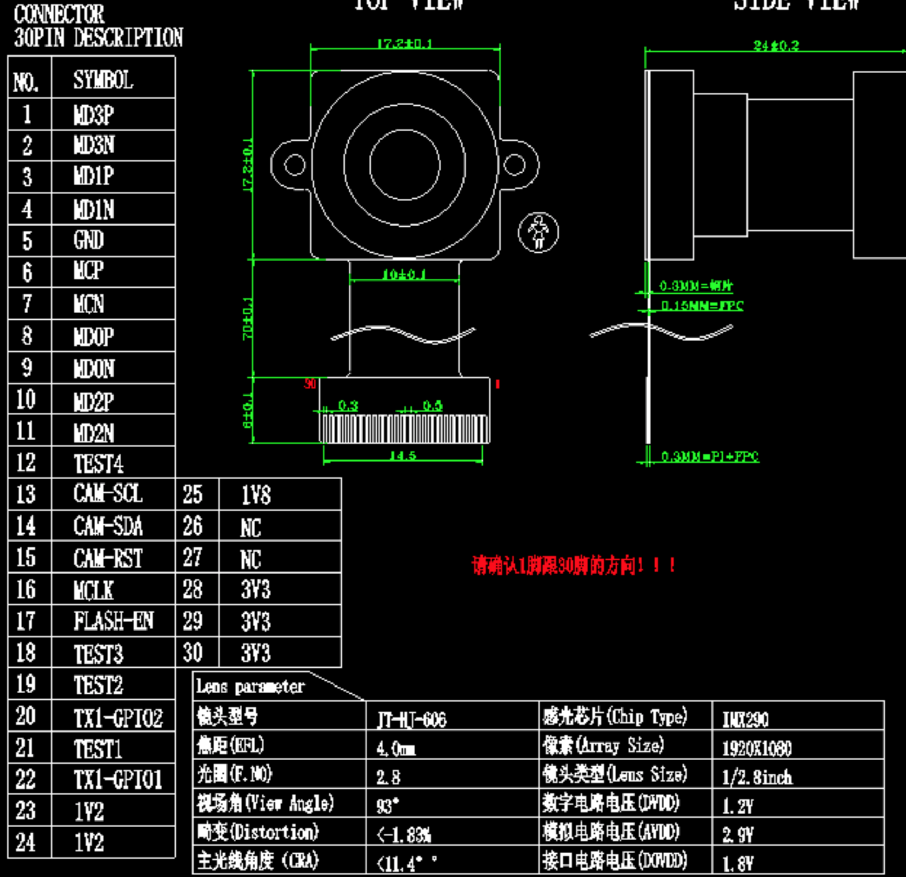

# 在Hi3516AV100 平台上移植 sony imx 290

### 前言

公司一款产品需要采集H264视频流；因为产品第一版的时间要求比较紧张，在淘宝上选择一个现成的方案：Hi3519V101平台 + imx290 Sensor（Hi3519V101  的V1.0.3.0 版 SDK 包含imx290驱动程序）。

因为淘宝购买的 Hi3519V101核心板预留接口太少，新版产品的核心板换成了Hi3516AV100平台。Hi3516A 的SDK并不包含imx290驱动，只能自己移植；因为第一次接触，走了很多弯路，希望这个教程能帮助后来的开发人员。

### 准备

#### 网上的移植方案

1、[分享3516a/d+imx290 2to1L WDR驱动+2016.9.23优化rtp图传效果，传输1080p30fp不卡](http://bbs.ebaina.com/thread-12458-1-1.html) ；社区大神@ljx6233535 分享了自己移植的imx290驱动，无奈该驱动是针对采用 SPI + LVDS接口的模组，我们使用的则是I2C + MIPI接口的模组。[sony-imx290-spi](./290-spi)

2、[悬赏：急！现金求Hi2516a+IMX290的集成方案](http://bbs.ebaina.com/thread-12603-1-1.html) 社区用户分享@王乾发 分享了他的移植经验，我也是按照他给的流程做的移植。

#### 基础知识

图像Sensor的驱动都放在 SDK开发包的 mpp/component/isp/sensor目录下，以Hi3516A自带的imx178驱动为例，[sony_imx178](./Hi3516AV100_SDK_V1.0.5.0/mpp/component/isp/sensor/sony_imx178) 目录下包含4个文件，ini文件是sensor的上电默认参数配置文件，驱动会读取ini文件的内容，并按照读取的参数初始化sensor寄存器；sensor_ctl.c主要用来完成接口 (I2C、SPI等) 的初始化和Sensor部分寄存器的配置；cmos.c 是Hi3516A的ISP 和sensor通信的接口，通过该接口Hi3516A ISP可以调整sensor的白平衡曝光等参数；Makefile文件帮助用户在sensor/lib 目录下生成libsns_imx178.a和 libsns_imx178.so静/动态驱动库。

生成驱动后，就可以开发针对该sensor的应用程序了。不过mpp/sample/common目录下提供了很多便利方法，使用这些可以缩短开发周期。为了使用这些便利方法，需要修改sample目录下的部分文件，添加对imx290的支持。

/ko/load3516a 文件会加载 海思媒体处理软件平台(mpp)需要的内核驱动，并根据指定的sensor完成与sensor通信接口的配置。

### 开始移植

##### 移植环境：

1. Ubuntu 14.04 LTS ；32bit 

2. Hi3516A_SDK_V1.0.5.0 开发包

3. sensor： imx290 （I2C + MIPI）

   

##### 驱动移植：

参考Hi3519V101 SDK_V1.0.3.0 提供的imx290驱动 和 Hi3516A SDK_V1.0.5.0提供的imx178驱动，完成了imx290在Hi3516A平台上的移植；移植过程中做了以下简化：

1. I2C部分，去掉了通过I/O模拟I2C协议的部分，只支持通过系统提供的I2C驱动(sensor_i2c.ko)访问。
2.  去掉了通过ini文件初始化默认配置的部分；不再读取ini文件，而是直接在代码里指定寄存器的初始化值。
3.  在Hi3519中 imx290的WDR模式支持linear、2To1、3To1三种模式，由于需求比较简单，只保留linear模式。

需要这些操作以上内容的，可以参考Hi3519提供的驱动，自行移植。

##### Tips：

在Hi3516A中，ISP操作Sensor的方式为：

a. 在系统头文件中定义接口函数，然后在sensor_ctl.c实现这些函数 。如在 hi_sns_ctrl.h中定义了sensor_write_register()函数，然后需要我们在sensor.ctl.c中实现这个函数。

​	b. 在系统头文件中定义接口函数的指针， 然后在cmos.c中实现相关函数，并赋值指针变量；如在hi_ae_comm.h中定义了函数指针：

`HI_VOID(*pfn_cmos_gains_upate)(HI_U32 u32Again, HI_U32 u32Dgain)`  

我们在cmos.c中实现了函数 

`HI_VOID cmos_gains_upate(HI_U32 u32Again, HI_U32 u32Dgain)` 

并将其赋值给指针变量

`pfn_cmos_gains_upate =  cmos_gains_upate;`

在Hi3519中 则全部采取了 第二种调用方式操作Sensor。

复制imx178的Makefile，执行make命令，将生成的驱动文件复制到/mpp/lib目录

#### 修改 /sample/ 

在==sample/common== 目录下 执行

`find .|xargs grep "imx178"` 命令

发现只有 sample_common.h 、sample_common_isp.h 和 sample_common_vi.h 包含imx178字符。在三个文件中每一处出现 imx178的部分加入支持imx290的内容(参考Hi3915 SDK)。

打开 ==sample/Makefile.param== 添加对imx290 的支持；

`ifeq ($(SENSOR_TYPE), SONY_IMX290_MIPI_1080P_30FPS)
​	SENSOR_LIBS += $(REL_LIB)/libsns_imx290.a
endif`

&

`ifeq ($(SENSOR_TYPE), SONY_IMX290_MIPI_1080P_30FPS)
​	CFLAGS += -DHI_MIPI_ENABLE
endif`

sample/venc_t 是sample/venc的简化版，用于测试。

### 修改load3516a

在load3516a添加对 imx290支持，load3516a的主要功能为：设置I2C引脚I/O复用；sensor相关的时钟的配置。

参考imx178的配置 和 Hi3519的load3519V101文件，imx290的配置如下：

`mx290)
​	himm 0x200f0050 0x2;                # i2c0_scl
​	himm 0x200f0054 0x2;                # i2c0_sda
​	himm 0x2003002c 0x90007            # sensor unreset, clk 37.125MHz, VI 250MHz
​        ;;`

完成以上修改，运行venc_t测试程序，就可以得到h264编码的视频文件。

如果要开机自启动，在/etc/init.d/rcS 文件中添加相关代码即可。
